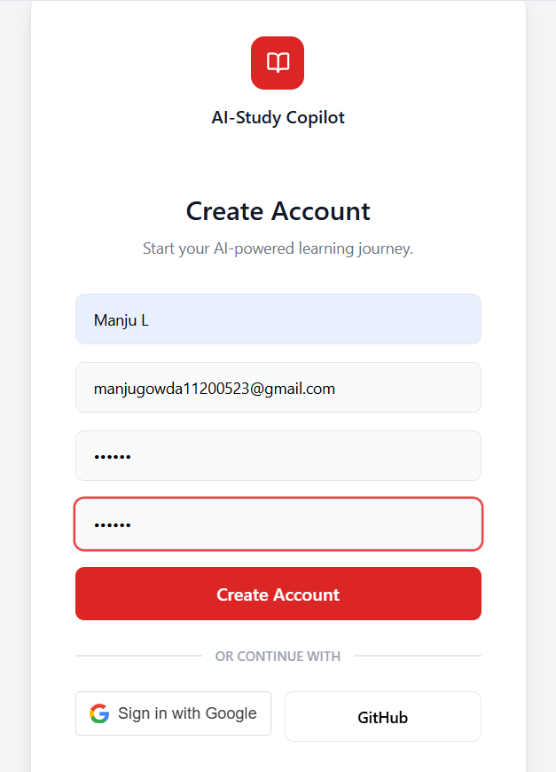
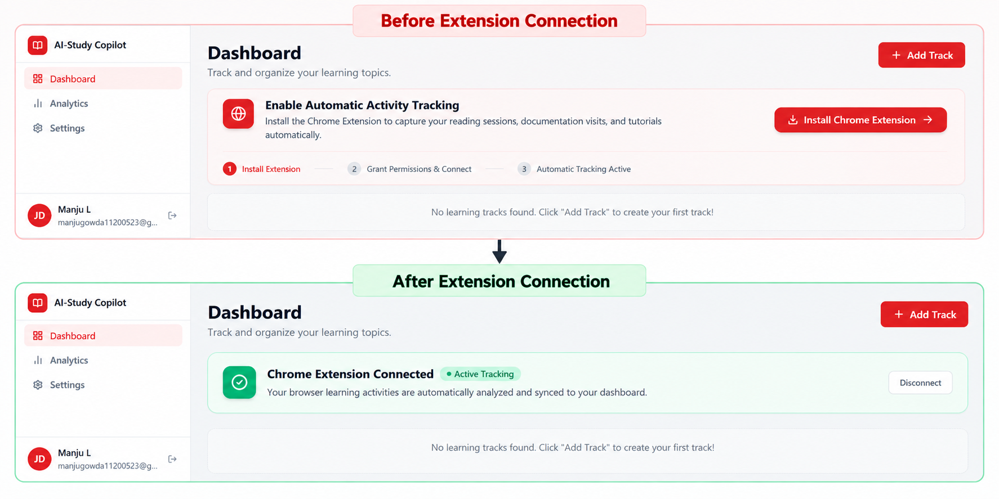
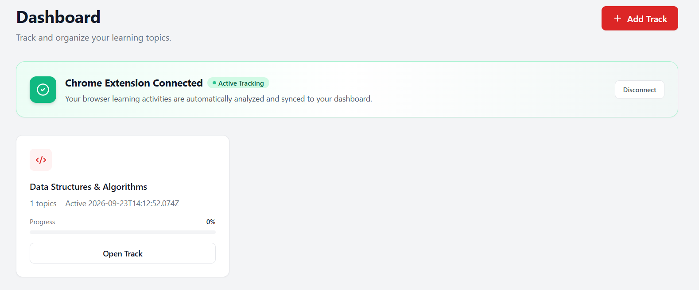
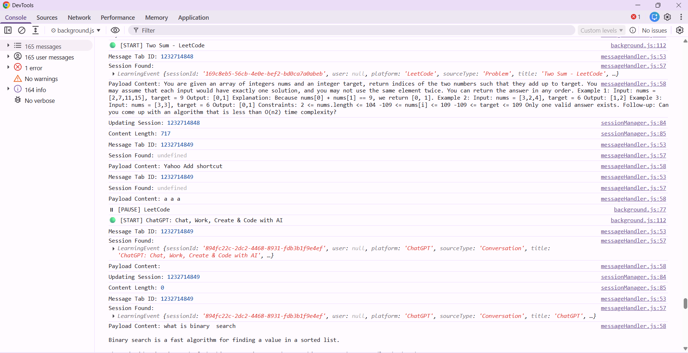
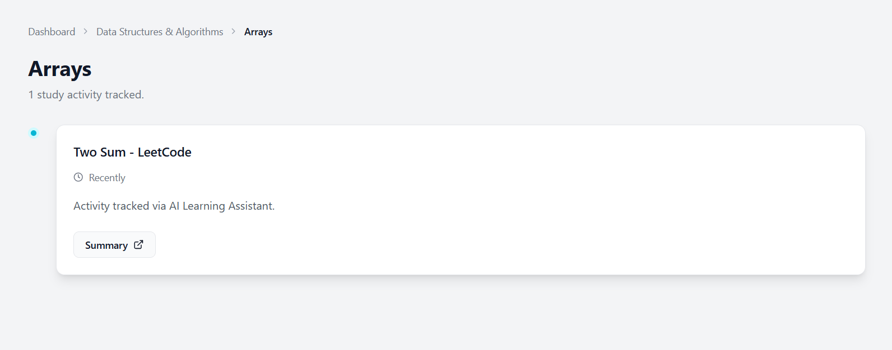
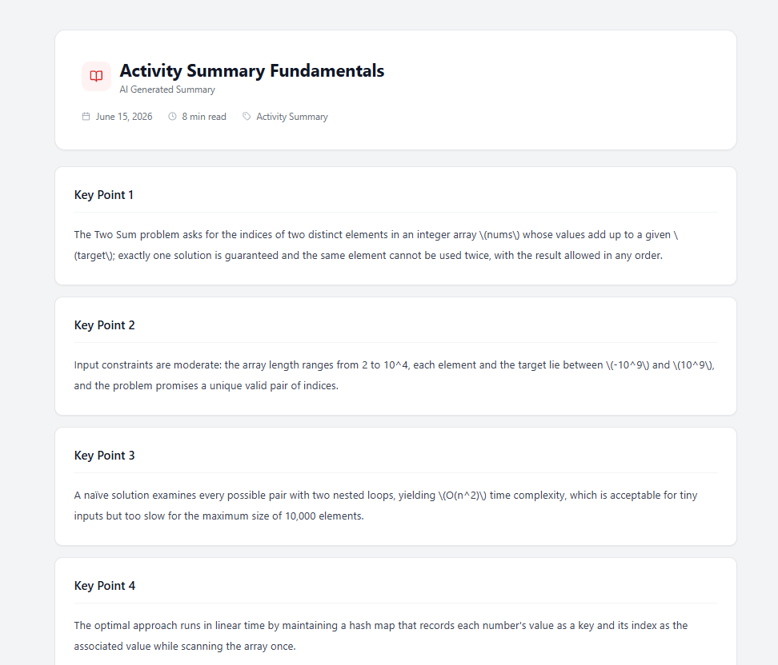
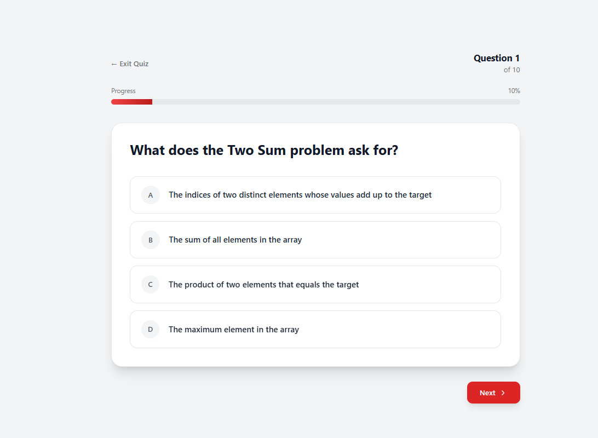

# 🧠 AI Learning Intelligence System

An AI-powered learning platform that automatically tracks learning activities across different websites using a Chrome Extension and processes them through AI services.

## 🚀 Overview

The system consists of:

- **Frontend** – User dashboard and authentication
- **Backend** – REST APIs, authentication and activity management
- **Chrome Extension** – Tracks learning activity from supported websites
- **AI Service Layer** – Processes learning activity using AI
- **Processing Service** – Handles asynchronous AI processing using Celery, Redis and Docker
- **MongoDB** – Stores users and learning activities

---

## 🏗️ Architecture

```text
                    ┌──────────────────┐
                    │      User        │
                    └────────┬─────────┘
                             │
                             ▼
                    ┌──────────────────┐
                    │    Frontend      │
                    │  React / Vite    │
                    └────────┬─────────┘
                             │
                       Login / JWT
                             │
                             ▼
                 ┌───────────────────────┐
                 │   Chrome Extension   │
                 │                       │
                 │ Activity Tracking     │
                 │ Session Management    │
                 └───────────┬───────────┘
                             │
                      Learning Event
                             │
                             ▼
                    ┌──────────────────┐
                    │     Backend      │
                    │ Node / Express   │
                    └───────┬──────────┘
                            │
              ┌─────────────┴─────────────┐
              ▼                           ▼
       ┌─────────────┐            ┌──────────────┐
       │   MongoDB   │            │ AI Processing│
       │             │            │ Celery/Redis │
       └─────────────┘            └───────┬──────┘
                                          │
                                          ▼
                                  ┌──────────────┐
                                  │ AI Results   │
                                  └──────┬───────┘
                                         │
                                         ▼
                                  ┌──────────────┐
                                  │  Dashboard   │
                                  └──────────────┘
```

---

## ⚙️ Local Setup

### Prerequisites

- Node.js
- Python 3.14
- Docker Desktop
- MongoDB
- Redis
- Google Chrome
- `uv`

Clone the repository:

```bash
git clone <YOUR_GITHUB_REPOSITORY_URL>
cd ai-learning-intelligence-system
```

---

## ▶️ Run the Project

The complete system runs using **5 terminals**.

### Terminal 1 — Backend

```bash
cd /c/ai_projects/ai-learning-intelligence-system/backend
npm start
```

Backend:

```text
http://localhost:5000
```

---

### Terminal 2 — Processing Service

Make sure Docker Desktop is running.

```bash
cd /c/ai_projects/ai-learning-intelligence-system/processing-ai-service
docker compose up
```

---

### Terminal 3 — AI Service

```bash
cd /c/ai_projects/ai-learning-intelligence-system/ai-service-layer
py -3.14 -m uv run uvicorn main:app --reload --port 5001 --log-level debug
```

---

### Terminal 4 — Summary / Quiz Worker

```bash
cd /c/ai_projects/ai-learning-intelligence-system/ai-service-layer
py -3.14 -m uv run celery -A src.queueData.tasks:app worker -P solo --loglevel=INFO -Q celery
```

---

### Terminal 5 — Frontend

```bash
cd /c/ai_projects/ai-learning-intelligence-system/frontend
npm run dev
```

Open:

```text
http://localhost:5173
```

---

## 🧩 Chrome Extension Setup

1. Open:

```text
chrome://extensions
```

2. Enable **Developer Mode**.

3. Click **Load unpacked**.

4. Select:

```text
browser-extension/
```

5. Open the AILIS dashboard.

6. Login and click **Connect Extension**.

The authentication token is securely stored in the extension and is used when sending learning activities to the backend.

---

## 🔄 How It Works

```text
Login
  ↓
Connect Chrome Extension
  ↓
Open a supported learning website
  ↓
Extension detects learning activity
  ↓
Learning session is recorded
  ↓
Activity is sent to Backend
  ↓
Backend stores the activity
  ↓
AI Processing
  ↓
Processed information appears on Dashboard
```

---

## 🌐 Currently Supported Websites

The extension currently tracks learning activity from:

- YouTube
- LeetCode
- ChatGPT
- GeeksforGeeks
- MDN
- W3Schools

The extension can be extended to support additional websites by adding platform-specific activity detection and session-handling logic.

---
## 📸 Working Prototype

### Login

The application provides an authentication-based entry point for users.



### Extension Connection — Before & After

The dashboard provides a step-by-step flow for installing and connecting the Chrome Extension. After connection, automatic activity tracking becomes active.



### Activity Tracking

The Chrome Extension detects learning activity from supported websites and sends the recorded activity to the backend.



### Extension Activity Console

The extension's service worker shows the detected learning session and synchronization process.



### Dashboard

The dashboard displays the user's tracked learning activities and processed learning information.



### AI Summary

Captured learning activity can be processed to generate an AI-based summary.



### AI Quiz

The processed learning content can also be used to generate quiz questions for knowledge verification.



---

## 🎥 Project Demo

A complete working demonstration follows the flow:

**Login → Connect Extension → Open Learning Platform → Track Activity → Dashboard → AI Summary → AI Quiz**

[▶️ Watch the complete project demonstration](YOUR_VIDEO_LINK_HERE)
---

## 🎥 Project Demo

A complete working demonstration of the system is available below:

**Login → Connect Extension → Open Learning Platform → Track Activity → Dashboard → AI Summary → Quiz**

[▶️ Watch the complete project demonstration](YOUR_VIDEO_LINK_HERE)

---

## 🔮 Future Extensions

The system can be extended with:

- More learning platforms
- Additional AI learning features
- Advanced learning analytics
- Personalized learning recommendations
- Cloud deployment
- Chrome Web Store distribution

---

## 👥 Project

**AI Learning Intelligence System**

Built as a collaborative project combining:

**Browser Extension + Web Application + Backend + AI + Cloud/Containerized Services**